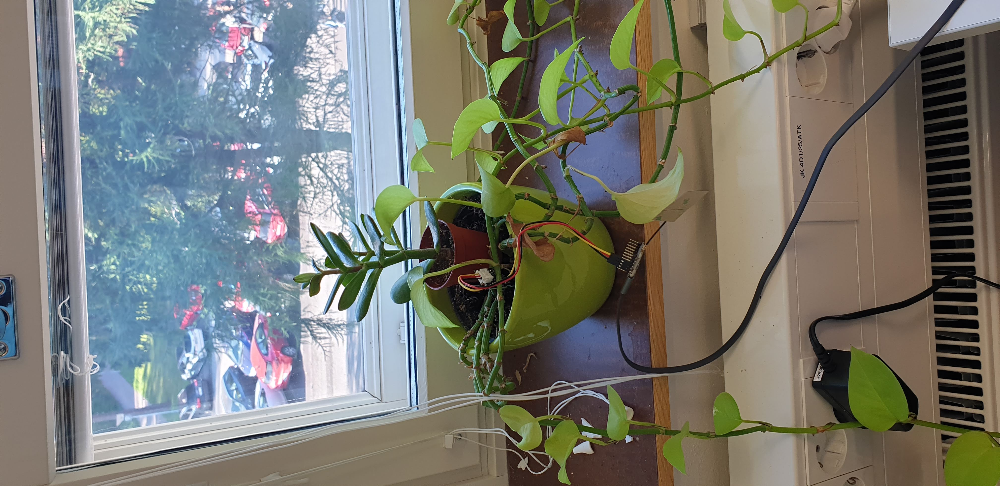
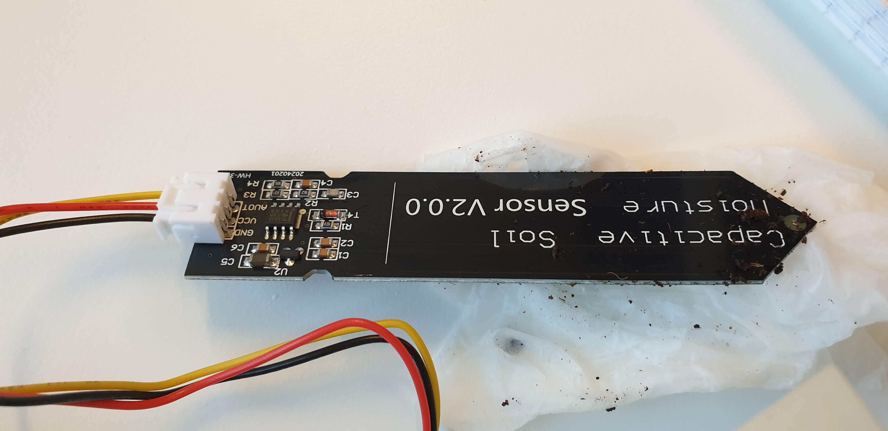
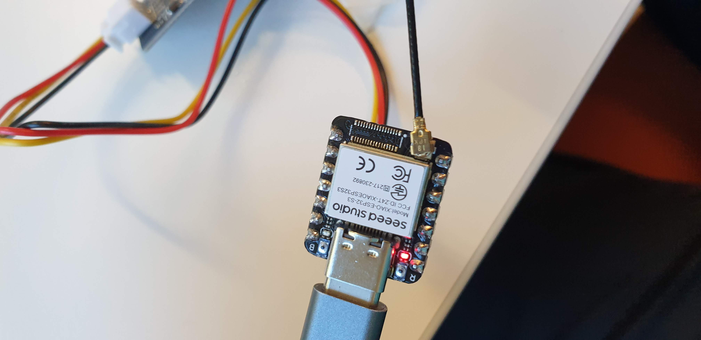
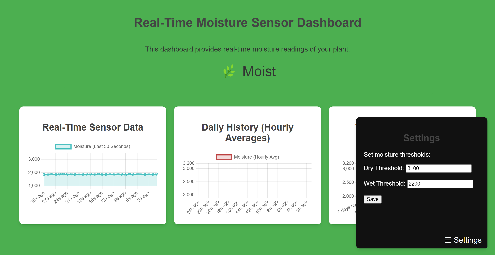

# 🌿 Plant Moisture Sensor Dashboard

This project provides a **real-time web-based dashboard** to monitor the soil moisture of your plant using an ESP32-based microcontroller and a capacitive soil moisture sensor. The dashboard displays real-time moisture levels, hourly averages over the past 7 days, and dynamically updates the page's theme based on the current moisture readings.
[](https://github.com/ajinkyagorad/SoilMoistureSensor/blob/9bca03e93a9a04b8d736f58e7b986c5d9d62d65a/imgs/demo.mp4)
<p align="center">
  
  
  
</p>
<p align="center">
  
</p>
## Features

- **Real-time Moisture Level Monitoring**: The dashboard shows the latest moisture reading, updated every 100ms.
- **Moisture Status Bar**: A visual bar that indicates the "waterness" of the plant pot, reflecting the soil moisture as a percentage.
- **Dynamic Page Theme**: The background color and moisture icon (🌵 for dry, 🌿 for moist, 💧 for wet) change according to the current moisture reading:
  - **Very Dry**: 🔥 icon with a red background.
  - **Dry**: 🌵 icon with a yellow background.
  - **Moist**: 🌱 icon with a light green background.
  - **Wet**: 🌿 icon with a lush green background.
- **Hourly Averages**: The dashboard also includes a history of hourly moisture averages for the past 7 days.
- **Responsive Web Interface**: The dashboard is accessible via any device connected to the same Wi-Fi network and auto-updates in real-time.

## Hardware Requirements

- **ESP32** microcontroller (such as Seeed XIAO ESP32C3 or ESP32 DevKit).
- **Capacitive Soil Moisture Sensor**.
- USB cable to connect the ESP32 to your computer for initial programming.
- Wi-Fi connection.

## Software Requirements

- **Arduino IDE** (with ESP32 board support installed).
- **Chart.js** (loaded via CDN for creating dynamic plots).
- **Capacitive Moisture Sensor Library** (if necessary, depending on the sensor you're using).

## How It Works

1. The ESP32 collects moisture data from the capacitive soil moisture sensor at a rate of 10 samples per second (100ms intervals).
2. The raw sensor data is displayed in real-time on the web-based dashboard.
3. Hourly averages are calculated from the sensor data and stored for historical analysis (7 days of data).
4. The moisture level is mapped to a percentage based on a calibration where **3100** corresponds to completely dry soil and **2200** corresponds to wet soil.
5. The moisture level dynamically updates a **progress bar** on the webpage, along with an icon that represents the moisture condition:
   - 🔥 Very Dry
   - 🌵 Dry
   - 🌱 Moist
   - 🌿 Wet
6. The webpage’s theme dynamically changes based on the moisture reading (from desert-like colors for dry to lush greens for moist).

## Project Structure

```
├ moisture_sensor_dashboard.ino   # Main Arduino/ESP32 sketch
└── README.md                           # Project documentation
```

## Installation Instructions

1. **Set Up the Arduino IDE**:
   - Download and install the [Arduino IDE](https://www.arduino.cc/en/software).
   - Add support for ESP32 by installing the **ESP32 board package** via the Arduino IDE:
     - Go to **File > Preferences**.
     - Add the following URL in the **Additional Boards Manager URLs**: 
       ```
       https://dl.espressif.com/dl/package_esp32_index.json
       ```
     - Go to **Tools > Board > Boards Manager** and install the **ESP32** package.

2. **Install the Required Libraries**:
   - Install any required libraries for the capacitive moisture sensor (if needed).

3. **Clone the Repository**:
   ```bash
   git clone https://github.com/your-username/plant-moisture-dashboard.git
   ```

4. **Upload the Code to ESP32**:
   - Open the `moisture_sensor_dashboard.ino` file in the Arduino IDE.
   - Set your Wi-Fi credentials in the code:
     ```cpp
     const char* ssid = "your-SSID";
     const char* password = "your-PASSWORD";
     ```
   - Select your ESP32 board from **Tools > Board**.
   - Select the correct **Port** from **Tools > Port**.
   - Click the **Upload** button to flash the code to your ESP32.

5. **Access the Web Dashboard**:
   - After the code is uploaded, open the Arduino Serial Monitor to find the ESP32’s IP address:
     ```
     WiFi connected
     IP address: 192.168.X.X
     ```
   - Open a web browser and enter the ESP32’s IP address to access the **Real-Time Moisture Dashboard**.

## Web Interface

The web interface provides a user-friendly display of real-time data and historical trends:

- **Real-Time Sensor Data**: A plot showing the last 30 seconds of soil moisture values, updated every 100ms.
- **Moisture Status Bar**: A slider-like progress bar that changes color and length depending on the soil moisture level.
- **Moisture Icon**: Unicode icons dynamically change depending on the moisture status (e.g., 🌵 for dry, 🌿 for wet).
- **Weekly History**: Another plot showing the average moisture level for the past 7 days (hourly averages).

## Customization

### Modify the Moisture Thresholds

If your sensor readings for wet and dry differ from the defaults, you can modify the thresholds directly in the code:

```cpp
const int dryThreshold = 3100;
const int wetThreshold = 2200;
```

### Change the Icons or Colors

To change the Unicode icons or colors that reflect the soil moisture condition, simply edit the `updateCharts` function in the HTML section of the code. For example:

```javascript
if (latestValue <= 2200) {
  document.body.style.backgroundColor = '#4CAF50';  // Green (Moist)
  moistureBar.style.backgroundColor = '#4CAF50';
  moistureIcon.textContent = "🌿 Moist";
}
```

## Future Improvements

- **Add Email or SMS Notifications**: Get notified when your plant needs watering.
- **Mobile-Friendly Enhancements**: Further optimize the UI for mobile devices.
- **Additional Sensors**: Integrate more sensors like temperature or humidity for more comprehensive plant care.

## License

This project is licensed under the MIT License - see the [LICENSE](LICENSE) file for details.

## Acknowledgements

- Special thanks to the [Chart.js](https://www.chartjs.org/) library for powering the data visualizations.
- Thanks to the open-source community for the ESP32 development resources.

---

🌿 **Happy Planting!**
